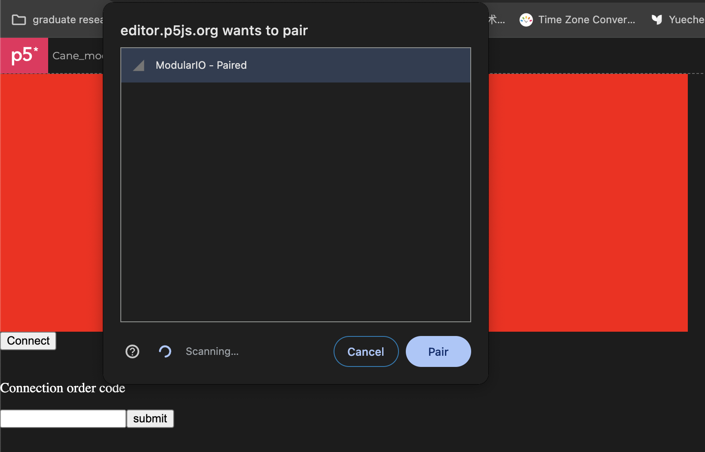
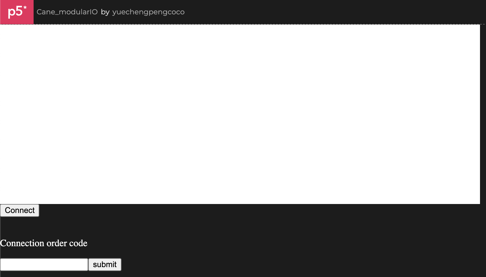
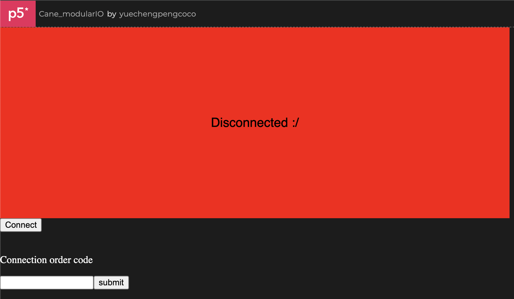
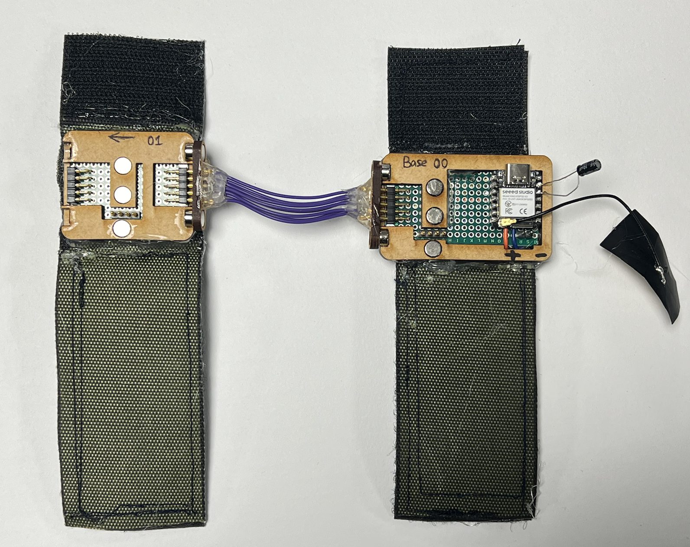
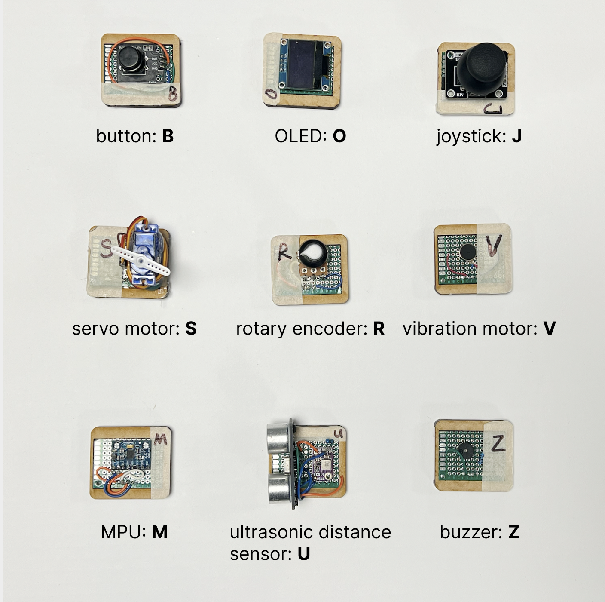
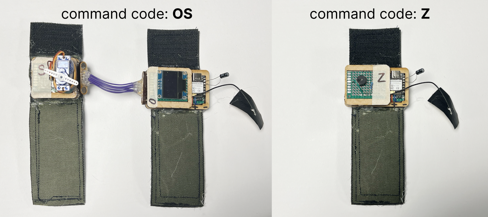
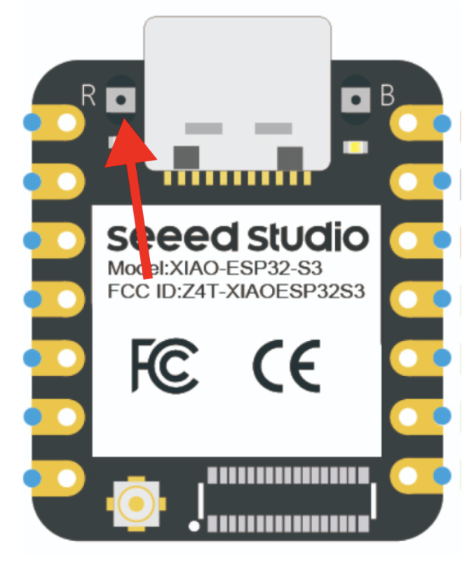

MobilityIO is a prototype that adds rich interactiveness - both input and output - to mobility devices.

# HOW TO USE
Check out the [demonstration video]().

Detailed steps ⬇️
- Plug in the battery. Notice the mark on the sensor base. __Left: positive, right: negative__.
- Launch the web app. Visit: https://editor.p5js.org/yuechengpengcoco/full/h3awrqUrm.
    - Click "connect".
    - In the pop-up window, select "ModularIO", then click the "Pair" button.
        - Chrome is the suggested browser. I haven't tested this application on other browsers. If using Chrome and this pop-up window is not showing, follow [this instruction](https://ddpyoga.zendesk.com/hc/en-us/articles/1260802363029-Enabling-WebBluetooth-in-the-Google-Chrome-browser).
    
    - If successfully connected, the canvas should turn white, meaning it's ready to display contents
    
    - If somehow disconnected, the canvas will turn red. Now maybe you should check whether the ESP32S3 is correctly powered (is the battery dead?) and try to reconnect (hit the "connect" again and start over).
    

- If needs two receptors, connect them with the purple connection wire (two versions: short and long). Notice the direction of the second receptor (the arrow on the base should be pointing "out" of the connection direction).
    

- Wrap the Velcro around the cane. Make sure it's tight enough so that it doesn't slip.

- Each component has its ID, specified on the tape of the component and the image below.
    

- Connect the component to the receptor(s) (make sure to do this step first, before submitting the ID code. Because for certain components, e.g. OLED and motion sensor, it needs to be connected to locate the I2C address).
    - ⚠️ OLED screen (O) and motion sensor (M) can only be attached to the base receptor (meaning they cannot be used at the same time).
    - ⚠️ When snapping on the __servo motor__, the device might get disconnected (the canvas turns red). To avoid it, snap the servo component gently and slowly to the base. If it already happened, just hit the "connect" button and reconnect.

- Enter the ID code into the text entry box and hit the "submit" button. The graph for components should show up. If not (or not responding correctly), turn to the "HOW TO DEBUG" section.
    - The format for a single receptor in use is `X`, where X = the ID of the attached component.
    - The format for the two receptors in use is `XY`, where X = the ID of the attached component on the "00" (base) receptor (the receptor with the MCU). and Y = the ID of the attached component on the "01" (second) receptor.
    

# HOW TO DEBUG
- __First rule__: if the interaction is not responding, just press the component against the base. There might be a weak connection issue from the Pogo pins.
    - common among the __servo motor (most common one)__, buzzer, and OLED screen.

- __Second rule__: if anything else is acting weird or the first rule doesn't work, just RESTART.
    - __First try to restart the p5 script__. In the fullscreen mode (no code), refresh the webpage; in the editor mode (half code, half canvas), hit the stop button and then the start button on the left.
    - __If it doesn't work, restart the ESP32S3__. You can either press the restart button (image below) on the ESP32S3 (might need long fingernails or a male Dupont pin to press it) or directly unplug the battery and plug it back in.
    

- __Cannot find the BLE device on the browser's pop-up window__: restart the ESP32S3. Don't work? Check if the battery is charged.
- __UI not showing__: restart the ESP32S3 and reconnect via the browser.

<!-- - If the web is frozen: sorry, it’s probably an undetected code bug🥺(I have killed most of those bugs though, there still might be some)
Refresh the page, after a while, in the pop up window select “exit page”
Double-click the “x” of the page, then start another p5 window. -->
- __Snap a component and the p5 shows BLE disconnected__ (especially the servo), just hit the "connect" button to reconnect to the esp32 (if it is the servo, press the component against the base to let it connect better). It is because of some overcurrent restarting issue.
<!-- (I have improved and decreased the restarting probability from 100% to around 20%. But sometimes it’ll still restart. Maybe it’s still the pogo connection issue that the touching points are connected and disconnected rapidly that the capacitor don’t have time to charge to prevent restarting) -->
<!-- If the UI is not showing after reconnect, stop and rerun the p5 script -->

-------------

# REFLECTIONS & NOTES
- the ultrasonic sensor is a 5v system and requires a power boost converter to work properly.
    - In the code, the pin for the ultrasonic sensor must be "D4" not just "4".
- the servo motor works well under 3.3v, but the pin number is GPIO order, not A/D order. (e.g. A0 = GPIO1; A4 = GPIO5).
- Plug the servo motor or the ultrasonic sensor to the ESP32S3 XIAO will cause the XIAO board to restart. My guess is that it'll trigger a current strike from 3.3v to GND. To prevent it, I add a 10Ohm resister in series with the other components (on the 3.3v side). It worked well!

- In practice, D4 and D5 will be configured as Analog read (INPUT) pin, Digital write (OUTPUT) pin, and I2C interface. I found that if D4 and D5 was firstly configured as INPUT or OUTPUT pin then try to connect the I2C sensor, it would not work. The solution was that after the pins are not used as I2C interface, set `Wire.end();`. Then if it needs start to use as I2C pins, set `Wire.begin();`. This method applied well to the case where the pins were set to OUTPUT before using it as I2C, but didn't work for setting pins to INPUT and doing some AnalogRead command. The solution to this was to set the pins (D4 and D5, not "A"4 "A"5) to OUTPUT before calling `Wire.begin();`. [Arduino Wire Library](https://www.arduino.cc/reference/en/language/functions/communication/wire/).

p5.js problems:
- myBLE.read(io1Characteristic, 'string', gotValueio) and myBLE.write(ioCharacteristic, value) are all one time execution. You cannot run both of them at the same time.
    - To run read continuously, you need to configure the gotValueio into something like `function gotValueio1(error, value) {
        if (error) console.log('error: ', error);
        if (notGoingToWrite)
        myBLE.read(io1Characteristic, 'string', gotValueio1);
        }` so that it can call itself again after it got value. Here we set an if statement that if we are going to write, it'll stop calling itself. Then we can use `myBLE.write(ioCharacteristic, value)` to write (after the `myBLE.read` is not executing anymore). After the write, if we want to read again, __we need to call the myBLE.read again__ (and set `notGoingToWrite` to false so that the myBLE.read can call itself again and again).
    